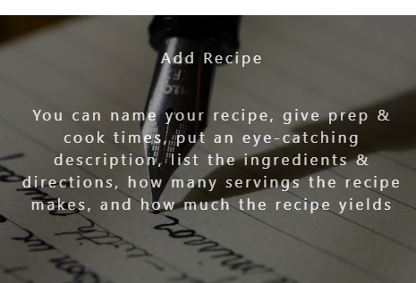

## My Cook Book

The purpose of this project is to give the user access to their own personal list of Recipes with the ability to
Create, Update and Delete recipes as they wish. This is done through a user friendly website which is optomised for a mobile platform.

 
## UX
 
This website will appeal to users who have an interest in home cooking or baking.

This section is also where you would share links to any wireframes, mockups, diagrams etc. that you created as part of the design process. These files should themselves either be included in the project itself (in an separate directory), or just hosted elsewhere online and can be in any format that is viewable inside the browser.

## Features
 
### Existing Features
- Feature 1 - allows users Create a custom Recipe of there choice by filling out the form which is located under Add Recipe link. This is located on the far right hand side on the home page. For mobile view(smartphone), the same link can be located in the drop downmenu or by scrolling to the bottom of the screen

- Feature 2 - allows to add a Recipe to their Favourite list which is achieved by ticking the Add to favourites checkbox under the edit recipe option. 

- Feature 3 - allows users to email a recipe to a friend or collegue by clicking on the email option  which is available on the Recipe page

- Feature 4 - allows users to edit any recipe by clicking on the edit button located on the Recipe page
- 

For some/all of your features, you may choose to reference the specific project files that implement them, although this is entirely optional.

In addition, you may also use this section to discuss plans for additional features to be implemented in the future:

### Features Left to Implement

- Future features may have included a user login option for the purpose of rating or reviewing recipes.

## Technologies Used

In this section, you should mention all of the languages, frameworks, libraries, and any other tools that you have used to construct this project. For each, provide its name, a link to its official site and a short sentence of why it was used.

- [JQuery](https://jquery.com)
    - The project uses **JQuery** to simplify DOM manipulation.

## Testing

In this section, you need to convince the assessor that you have conducted enough testing to legitimately believe that the site works well. Essentially, in this part you will want to go over all of your user stories from the UX section and ensure that they all work as intended, with the project providing an easy and straightforward way for the users to achieve their goals.

Whenever it is feasible, prefer to automate your tests, and if you've done so, provide a brief explanation of your approach, link to the test file(s) and explain how to run them.

For any scenarios that have not been automated, test the user stories manually and provide as much detail as is relevant. A particularly useful form for describing your testing process is via scenarios, such as:

1. Contact form:
    1. Go to the "Contact Us" page
    2. Try to submit the empty form and verify that an error message about the required fields appears
    3. Try to submit the form with an invalid email address and verify that a relevant error message appears
    4. Try to submit the form with all inputs valid and verify that a success message appears.

In addition, you should mention in this section how your project looks and works on different browsers and screen sizes.

You should also mention in this section any interesting bugs or problems you discovered during your testing, even if you haven't addressed them yet.

If this section grows too long, you may want to split it off into a separate file and link to it from here.

## Deployment

This section should describe the process you went through to deploy the project to a hosting platform (e.g. GitHub Pages or Heroku).

In particular, you should provide all details of the differences between the deployed version and the development version, if any, including:
- Different values for environment variables (Heroku Config Vars)?
- Different configuration files?
- Separate git branch?

In addition, if it is not obvious, you should also describe how to run your code locally.

## Credits

### Content
- The text for Add Recipe description was copied from the [Alldishes submit your recipe](http://dish.allrecipes.com/customer-service/submit-your-recipes/)

### Media
- The photos used in this site were obtained from ...

- [Unsplash](https://unsplash.com/)

### Acknowledgements

I took influence from the following websites

 In particular the Recipe layout
- [BBC Good Food](https://www.bbcgoodfood.com/)

- [Delish, Recipes, Party, Food](https://www.delish.com/)

